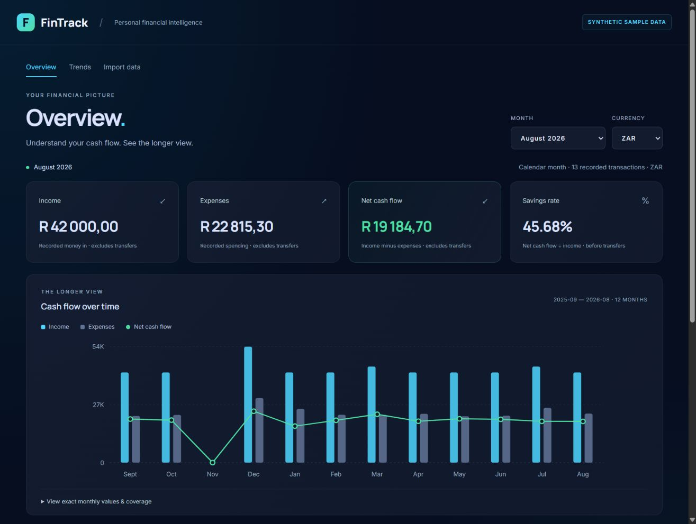
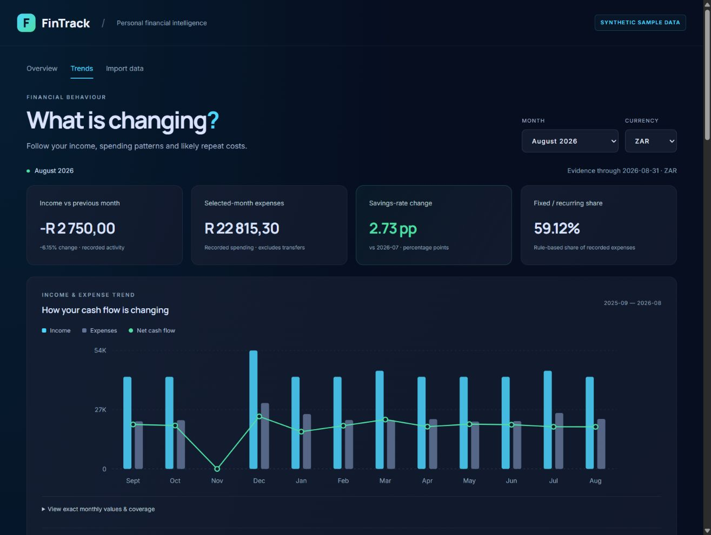
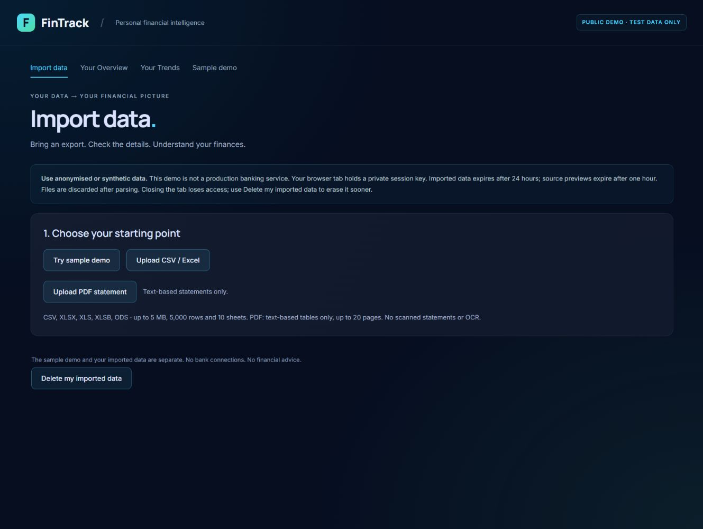
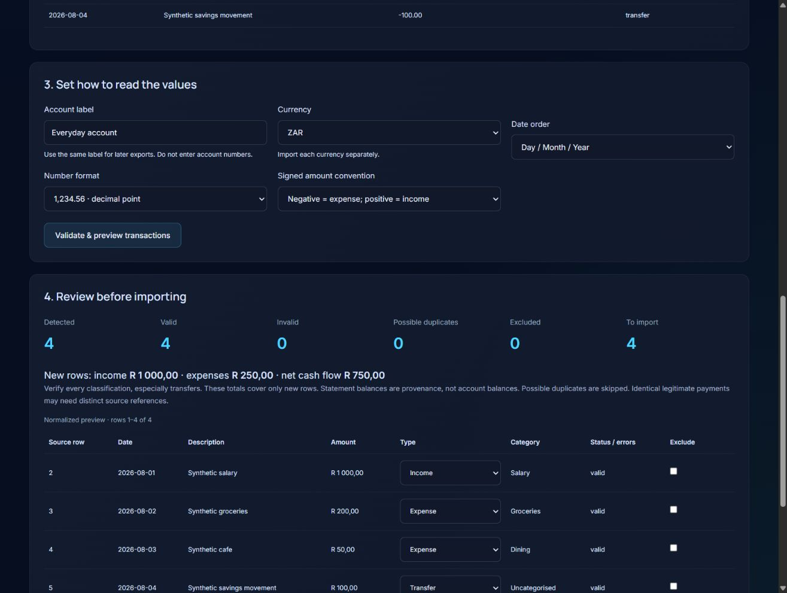
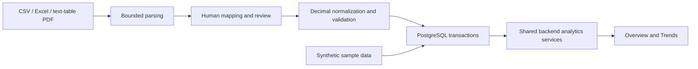

# FinTrack

FinTrack is a personal financial intelligence platform that converts transaction data into explainable cash-flow and behavioural analytics.

**Status:** feature frozen; locally verified and prepared for public deployment. The public URL is pending Render/Supabase account configuration.

## The problem

Transaction exports tell you what moved through an account, but understanding the pattern takes more work. FinTrack turns those records into a clear view of income, spending, savings behaviour and likely recurring costs—while showing where the data is incomplete.

Start with **Try sample demo** to explore synthetic finances immediately, or **Upload CSV / Excel** to review your own anonymised export. No bank connection is required.

## Product screenshots

All screenshots use synthetic data.





<details>
<summary>See the import experience</summary>





</details>

## Implemented

- **Reviewed data import:** automatic column suggestions, sheet/header selection, manual mapping, source preview, row-level validation, transfer overrides and duplicate detection.
- **Overview:** monthly income, expenses, net cash flow, savings rate, 12-month history and trailing 3/6-month averages.
- **Trends:** category histories/comparisons, income and savings-rate trends, likely recurring transactions, and explainable fixed/variable/unclassified spending.
- **Transparent coverage:** missing months, partial months, insufficient history and unavailable balances/net worth are explicit.
- **Isolated demo sessions:** temporary anonymous access, automatic expiry and explicit data deletion.
- **Immediate sample experience:** deterministic synthetic ZAR records across September 2024–August 2026, including a deliberate missing month.
- **Deployment preparation:** PostgreSQL-backed public mode, a health endpoint, restricted CORS, Render configuration and a small free-hosting wake-up message.

## Architecture



The React frontend presents server-calculated results. FastAPI separates file parsing, normalization, session ownership and persistence from the existing financial analytics services.

Public deployment uses **Render Static Site → Render Free FastAPI service → Supabase Free PostgreSQL**. Only the loopback local demo uses isolated SQLite for convenience. Both paths use the same transaction models and analytics.

Public demo mode exposes the synthetic sample and session-scoped import/analytics endpoints. Legacy user-ID CRUD/authentication routes are not exposed in that mode.

### Tech stack

| Layer | Technology |
|---|---|
| Frontend | React, Vite, React Router, TanStack Query, Axios, Tailwind/CSS |
| API and validation | Python 3.12, FastAPI, Pydantic |
| Persistence | SQLAlchemy, PostgreSQL; SQLite for local demo/tests |
| Import parsing | Python CSV, python-calamine, pdfplumber |
| Verification | Python unittest, isolated API tests, browser acceptance, production build and targeted ESLint |

## Financial methodology

Calculations are deterministic backend code, not LLM-generated answers.

- Income and expenses exclude transfers.
- **Net cash flow = income − expenses.**
- **Savings rate = net cash flow ÷ income × 100.** With no recorded income, the rate is unavailable.
- Monetary calculations use Decimal arithmetic and two-decimal transaction amounts. Currencies remain separate; there is no inferred FX conversion.
- Calendar gaps represent zero *recorded activity*, not proof of zero financial activity. Coverage and partial months remain visible.
- Monetary rolling averages include the selected month and calendar gaps. Savings-rate trend means exclude unavailable months; Overview's aggregate rate uses total income and net cash flow.
- Percentage changes are unavailable with a zero comparison baseline. Savings-rate changes use percentage points.
- Recurrence uses normalized descriptions, similar amounts, cadence and repeated observations. Results are candidates with evidence, not confirmed commitments.
- Recurring expense matches inform fixed/variable classification. The partitions reconcile to recorded expenses and expose their limitations.
- Statement balances are stored only as import provenance. Account balances and net worth remain unavailable because the current data model cannot support them reliably.

Core modules: [monthly analytics](backend/app/services/financial_analytics.py), [trends](backend/app/services/trends.py), [recurrence](backend/app/services/recurring.py), [import normalization](backend/app/services/import_normalization.py).

## Supported imports

| Format | Scope |
|---|---|
| CSV | Common delimiters/encodings, signed Amount or separate Debit/Credit layouts |
| XLSX | Sheet selection, renamed columns and title rows above the table |
| XLS / ODS | Supported by the shared spreadsheet parser and synthetic parser fixtures |
| XLSB | Parser-supported; no generated end-to-end XLSB fixture yet |
| PDF | Best effort: machine-generated text with reliable transaction tables |

Every import requires human confirmation. Date order, decimal separator, currency and sign convention are explicit. Invalid rows are never silently converted to zero; duplicates are shown before confirmation.

Limits: 5 MB, 5,000 rows, 50 columns, 10 sheets; PDF limit 20 pages. Scans/OCR, encrypted documents, arbitrary loose-text statements and unverifiable dates are unsupported. Export CSV/Excel when extraction is uncertain.

## Privacy and demo limitations

**Use anonymised or synthetic data only. This is not production or bank-grade security.**

- Browser-tab session keys isolate imported data. Only token hashes are stored server-side; keys are not placed in URLs.
- Uploaded files are discarded after parsing. Parsed review rows expire after one hour and are cleared on confirmation.
- Imported data expires after 24 hours. Access ends at expiry; cleanup runs at startup and every 15 minutes while the backend is awake. Free-tier sleep can delay physical deletion.
- **Delete my imported data** removes that session's records immediately.
- Public mode requires PostgreSQL. Credentials belong only in backend environment settings, never the frontend or Git.
- PostgreSQL RLS is enabled for demo tables without browser-role policies. The deployment guide additionally requires disabling Supabase's unused Data API.
- Lightweight quotas/rate limits are demo safeguards, not a complete abuse-prevention or authentication system.
- No financial recommendations, automated decisions or bank connections are provided.

## Local setup

Prerequisites: **Python 3.12** and **Node.js compatible with Vite 8** (Node 22.12+).

From the repository root:

```powershell
py -3.12 -m venv .venv
.\.venv\Scripts\python.exe -m pip install -r backend\requirements-dev.txt
cd frontend
npm ci
Copy-Item .env.example .env
```

Skip the copy if you already have a configured frontend `.env`. `VITE_API_BASE_URL` is the preferred variable; existing `VITE_API_URL` configuration remains supported.

Start the API in one terminal:

```powershell
cd D:\Dev\Repos\fintech-platform\backend
..\.venv\Scripts\python.exe -m scripts.run_demo
```

Start the frontend in another:

```powershell
cd D:\Dev\Repos\fintech-platform\frontend
npm run dev -- --host 127.0.0.1 --port 5173 --strictPort
```

Open **http://127.0.0.1:5173/import** and choose **Try sample demo**.

The launcher uses ignored `backend/.demo/overview.sqlite3`, binds only loopback, and does not alter the normal PostgreSQL configuration. Imported and sample data remain separate.

## Testing and verification

```powershell
cd backend
..\.venv\Scripts\python.exe -m unittest discover -s tests -p "test_*.py"
cd ..\frontend
npm run build
npx eslint src/pages/UploadPage.jsx src/pages/DashboardPage.jsx src/pages/AnalyticsPage.jsx src/features/imports.js src/features/dashboard.js src/core/apiBase.js src/core/apiClient.js src/app/router.jsx vite.config.js
```

Current verification: **81 backend tests**, production build and targeted lint pass. Tests cover financial arithmetic, transfers, calendar windows, user/currency isolation, recurring rules, parser safety, reviewed imports, duplicate prevention and session lifecycle.

Browser acceptance covers sample Overview/Trends, CSV/XLSX/PDF imports, duplicate detection, malformed-row validation and deletion. A separate temporary **PostgreSQL 18** check verified fresh schema initialization, the sample seed, three fixture imports/analytics, deletion and RLS isolation.

Independently reconciled synthetic fixture totals for August 2026:

| Fixture | Transactions | Income (ZAR) | Expenses (ZAR) | Net cash flow (ZAR) |
|---|---:|---:|---:|---:|
| Standard CSV | 4, including a transfer | 1,000.00 | 250.00 | 750.00 |
| Debit/Credit CSV | 3 | 2,000.00 | 625.00 | 1,375.00 |
| Renamed-header XLSX | 4, including a transfer | 3,000.00 | 699.99 | 2,300.01 |

The same figures were confirmed through the existing analytics API on SQLite and PostgreSQL. Fixtures contain no real financial data.

## Deployment

See **[the deployment guide](docs/PUBLIC_DEMO.md)** and **[render.yaml](render.yaml)**.

- **Backend:** `pip install -r requirements.txt`; `python -m scripts.serve`; health `/health`. Binds `0.0.0.0` using Render's `PORT`.
- **Database:** dedicated Supabase Free PostgreSQL project; put the TLS connection string in Render's secret `DATABASE_URL`.
- **Backend settings:** `DEMO_MODE=true`, `LOCAL_DEMO=false`, exact HTTPS `CORS_ALLOWED_ORIGINS`, `SESSION_HOURS=24`.
- **Frontend:** `npm ci && npm run build`; publish `dist`; set `VITE_API_BASE_URL` to the deployed HTTPS backend. SPA rewrites support direct navigation and refresh.
- Startup creates missing tables and seeds synthetic data idempotently. No manual migration is needed for a fresh dedicated database.
- Free hosting may sleep; the UI explains the wake-up wait.

**Not deployed yet:** account setup, secrets, hosting permissions and the final live smoke test require the project owner's actions. Local PostgreSQL verification does not certify the Supabase/Render configuration.

## Future work — not implemented

Development is feature frozen for the portfolio release. Potential later work includes forecasting, decision scenarios and AI explanations grounded in calculated analytics. These are roadmap ideas, not current capabilities.

Full authentication, bank integrations, billing, anomaly detection and automated financial recommendations are outside the current demo.
